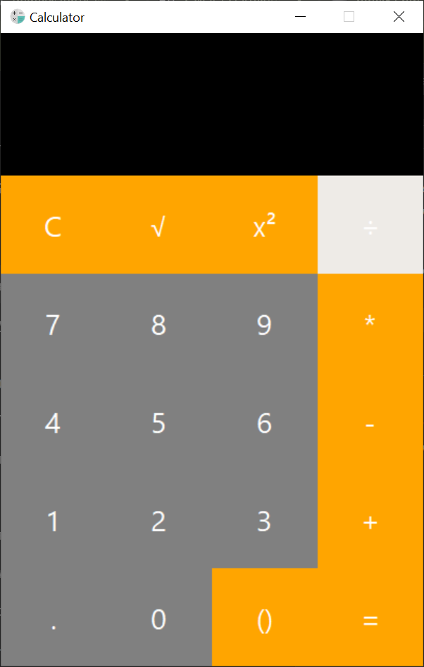
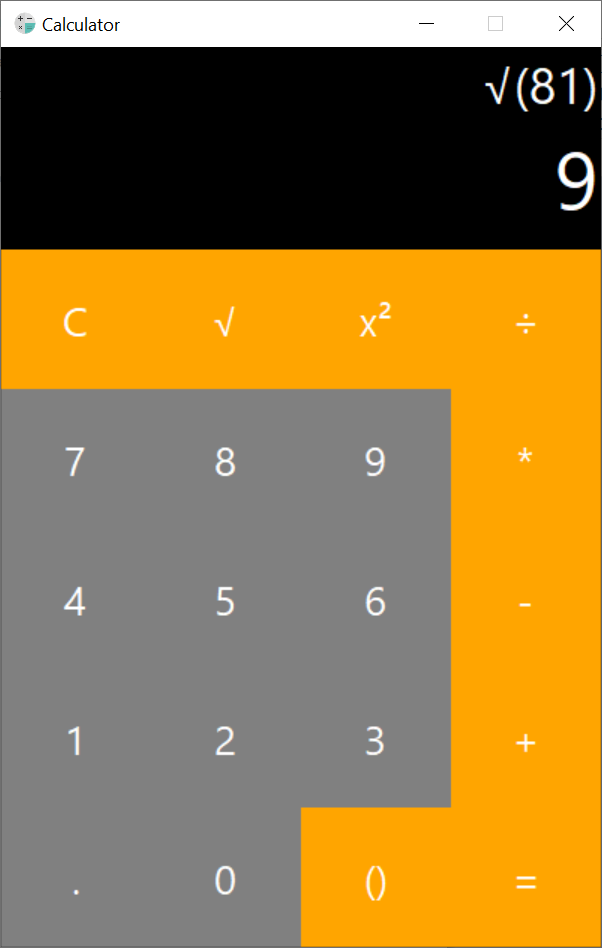
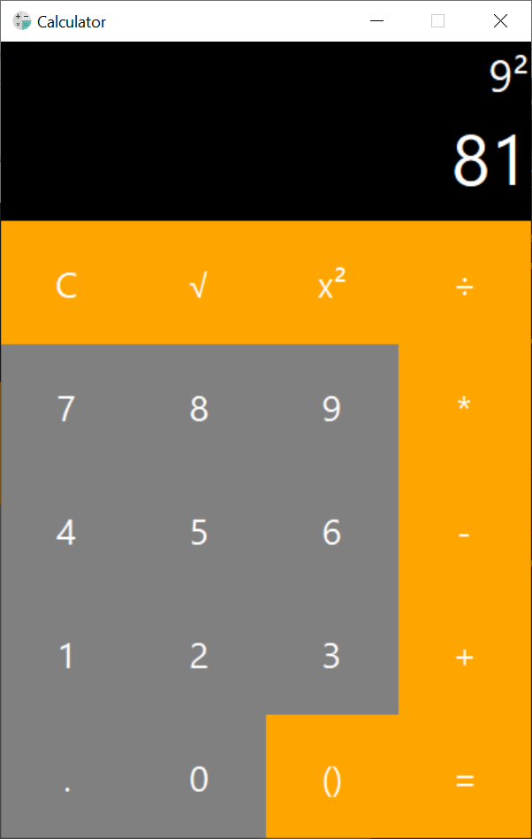
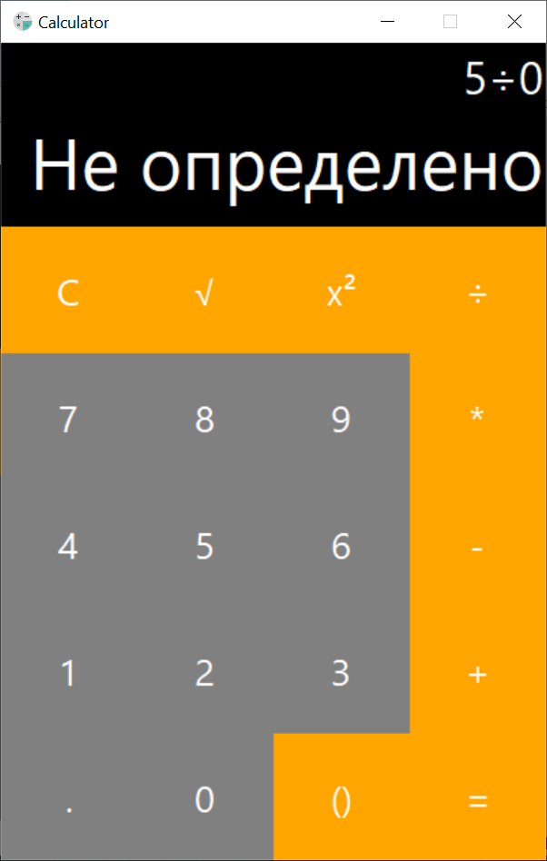
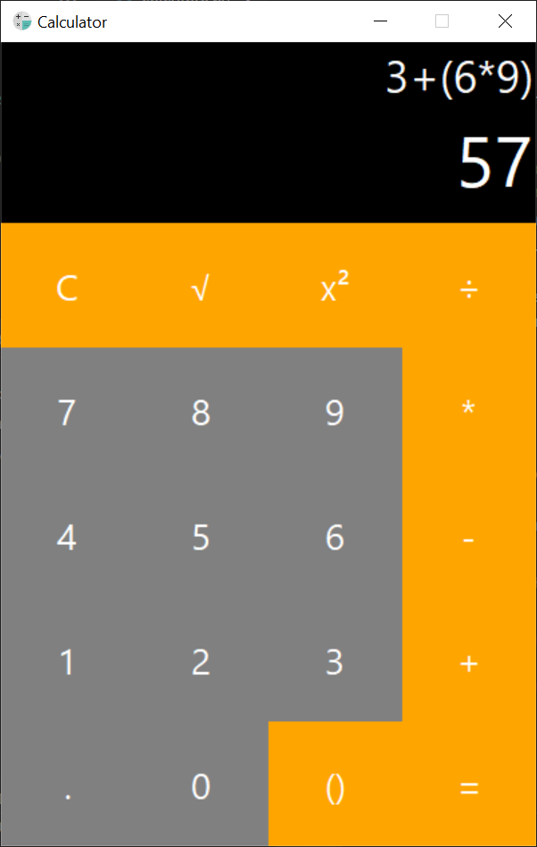

# Калькулятор

Это простое приложение калькулятора, разработанное с использованием библиотеки Tkinter для Python. Калькулятор поддерживает базовые арифметические операции, включая возведение в квадрат и извлечение квадратного корня, а также работу с скобками.


## Особенности

- Базовые арифметические операции: сложение, вычитание, умножение, деление.
- Операции возведения в квадрат и извлечения квадратного корня.
- Возможность использования скобок для уточнения порядка операций. (Обратите внимание, что калькулятор не поддерживает вложенные скобки, но позволяет эффективно управлять порядком выполнения операций.)


## Installation

Для запуска калькулятора на вашем компьютере необходимо только наличие Python (версия 3.7 и выше). Все используемые библиотеки являются встроенными, в том числе `tkinter`, которая используется для создания графического интерфейса.

- Убедитесь, что у вас установлен Python версии 3.7 или выше. Вы можете скачать его с официального сайта: [python.org](https://www.python.org/downloads/).
- Запустите скрипт:

```bash
  python calculate.py
```
    
## Структура кода
- CalculatorApp — основной класс приложения, который управляет окном, темой и запуском.
- Display — отвечает за отображение введенных значений и результатов.
- Keypad — создает и размещает кнопки на экране.
- CalculatorLogic — содержит логику вычислений и проверку корректности выражений.
## Пример использования
- Нажмите цифры для ввода числа.
- Нажмите операторы для выполнения математических операций.
- Используйте кнопки ` C ` для очистки экрана и `=` для получения результата.


## Примечания
- Если результат вычислений является целым числом, он будет отображен как целое число, в противном случае — с точностью до 7 знаков после запятой.
- В случае ошибки в вычислениях будет выведено сообщение `"Не определено"`, ошибки включают в себя `ZeroDivisionError` и `ValueError`
- Калькулятор не поддерживает вложенные скобки, но позволяет удобно управлять порядком выполнения операций с помощью одной пары скобок.
## Screenshots

1. **Главный экран калькулятора**
   
    
   
2. **Пример использования квадратного корня и возведения в квадрат:**
   
    
    
   
3. **Ошибка или предупреждение (деление на ноль):**
   
    
    
   
4. **Использование скобок для управления порядком операций:**
   
    


## 🛠 Skills
Python


## License
Этот проект является открытым исходным кодом и распространяется под лицензией 
[MIT](https://choosealicense.com/licenses/mit/).

